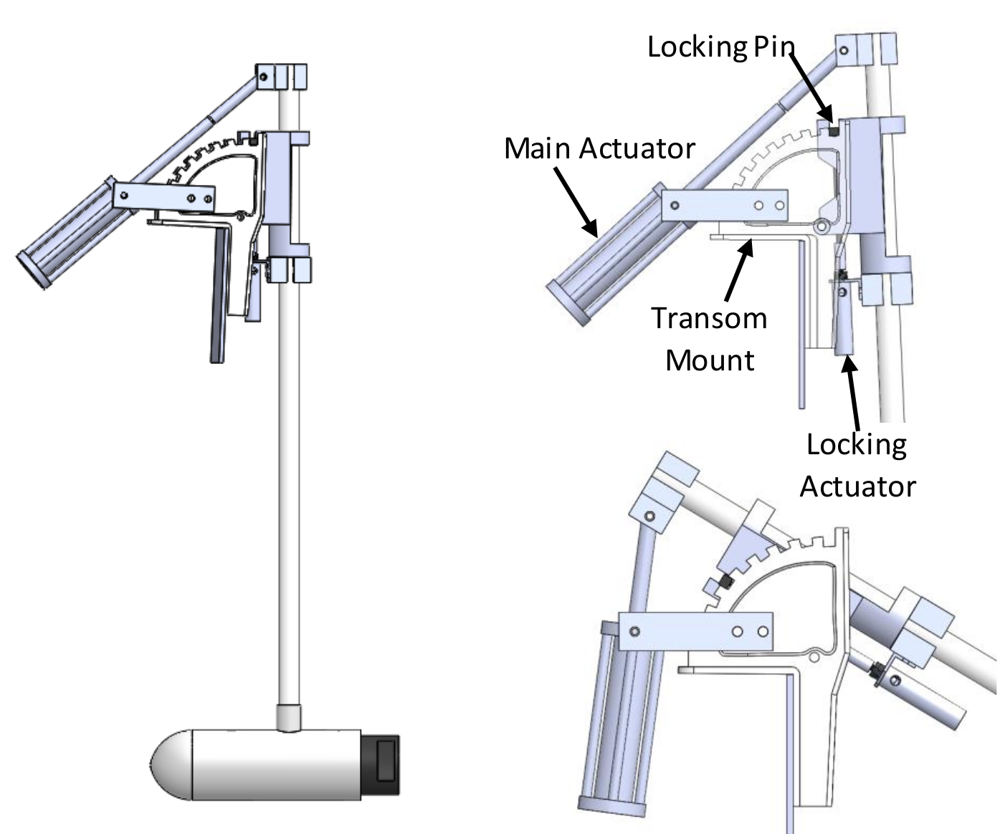
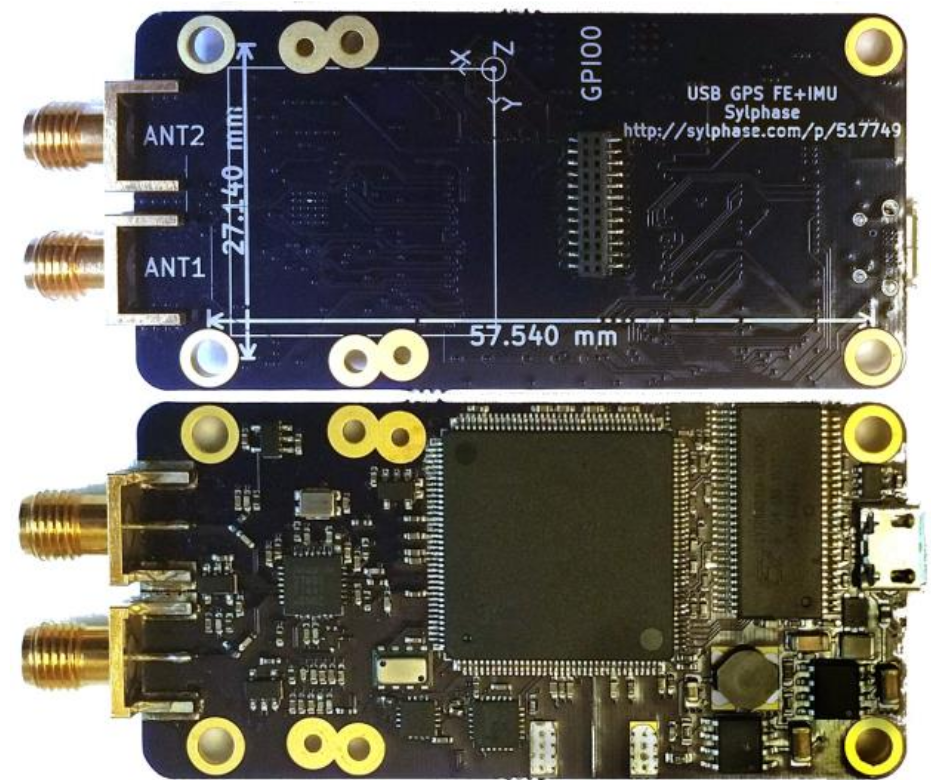

# Introduction

The University of Florida’s (UF) Team NaviGator AMS is a
multidisciplinary group composed of undergraduate and
graduate students from the departments of Electrical and
Computer Engineering and Mechanical Engineering. This
project is primarily sponsored by the Machine Intelligence
Lab (MIL), which has nearly 21 years of experience in
competing in the AUVSI Foundation’s robotics competitions,
including numerous championships in the RoboSub,
RoboBoat Competitions, and the defending champion from 2016 RobotX event. Due to the larger scale of the
Maritime RobotX Challenge, MIL has partnered with the
Center for Intelligent Machines and Robotics (CIMAR), a lab
that has competed in three DARPA challenges and has
extensive experience with developing highly intelligent large-
scale autonomous vehicles. Between MIL’s experience in
autonomous maritime systems design and CIMAR’s
experience in software architecture design, Team NaviGator
AMS puts forth a competitive vehicle for the Maritime RobotX Challenge.

# Vehicle Design

This section of the paper will describe the hardware and
software that was developed for this competition, as well as
the motivations behind these choices. This will include
descriptions of early iterations of hardware and software that
may have failed, what was learned in that process, and how
that knowledge was integrated to improve on the designs.

## Mechanical Subsystems

The mechanical platform used for the NaviGator ASV is a
modified WAM-V research vessel developed by Marine
Advanced Research. Several of the mechanical modifications
that the team has made will be detailed in this section. A computer-aided design (CAD) of NaviGator ASV is shown in Fig. \ref{navigator}. 

### Propulsion
NaviGator ASV’s propulsion system began
as two forward-facing stern thrusters, providing the ASV with
a skid-steer configuration. After a short time of testing, it
became apparent that adding more thrusters and mounting
them at an angle would simplify the vectoring of the thrust to
achieve a desired motion, as well as adding the capability of
lateral motion. The current configuration features two bow and
two stern thrusters oriented at a fixed 45 degrees. This is a
thruster configuration that the team used in the 2013
RoboBoat Competition with much success, earning first place.
In addition to improved maneuverability, using four thrusters
provides redundancy in the system, allowing the ASV to still
have maneuverability even if either both bow thrusters or both
stern thrusters fail. This feature was invaluable when a motor
driver died minutes before a qualification run in the 2013
RoboBoat Competition. With a quick modification to the
thruster mapper program, the ASV was able to operate with
just three thrusters, saving the run. Moreover, during the 2016 RobotX Maritime Challenge, NaviGator was able to repeatedly and successfully station keep and maneuver the course despite rough currents and winds. The major disadvantage of
this configuration is that the fixed angles of the thrusters
means that it is not particularly efficient moving in any
direction. However, as was demonstrated in 2016, for the tasks that the Navigator ASV is
designed to perform, maneuverability provides a significant advantage in maintaining stability.

Mounting the thrusters posed many challenges and required
several design iterations, especially for the bow thrusters. For
the ASV to be deployed from a trailer, the bow thrusters had
to be either removed or raised during deployment so they
would not collide with the trailer structure. Thus, we implemented a student designed auto-deploy system for the thrusters (Fig. \ref{auto_deploy}), which also aided in the efficiency of deploying NaviGator. The system uses two pneumatic linear actuators to rotate the thruster about the transom mount and to lock the thruster in place. The main actuator is mounted in a tandem style to allow it to pivot as the system rotates.  To retract the thruster, the locking actuator extends and moves the spring-loaded locking pin. The main actuator then retracts pulling the thruster to an upward position. The air pressure to the locking actuator is then released causing the locking pin to fall into a lock position. The air pressure is then released form the main actuator as it no longer needed to hold the thruster in place. To deploy the thruster, the same process is executed in reverse. This system not only saves time but also makes it so that only one person has to get in the water to pull the boat onto or off of the shore.

### Sensor Mast

The need for a stable sensor platform is
paramount in machine vision applications. The preliminary
design utilized an 80/20 aluminum rail truss, which did not
provide the required stiffness and resulted in smearing of the
vessel’s detection data. The initial sensor platform also did not
raise the LIDAR system high enough to permit detection of
obstacles in immediate proximity to the pontoons, a problem
rectified in the final design.

As previously mentioned, the cameras, LIDAR, and GPS
antenna require a rigid support. The need for an unobstructed
GPS antenna guided the design towards a mast structure. For
transport to the competition site, the assembly had to fit within
the prescribed envelope of a Pelican Products transport case,
requiring a modular assembly process. These target
specifications led to a base-and-tree assembly, where the mast
is simply welded to a plate that then fastens to the payload tray
via a superstructure. For corrosion resistance and
manufacturability, 6063 aluminum was chosen. To simplify
the assembly process, fastener types were standardized. The
mast is centered laterally on the ASV, which helps create a
well-defined coordinate system that permits simpler software
transformations.

### Electronics Box

NaviGator ASV’s electronics are
housed in a Thule Sidekick cargo box. The team originally
considered commercial waterproof boxes, but began looking
for other options due to their high costs. One student
suggested the idea of using a cargo box after being inspired by
family road trips they had taken when they were younger.
While traditionally used to mount on the top of cars to provide
additional storage, the cargo box was an ideal electronics
enclosure due to its watertight integrity, aerodynamic form
factor, low cost, and a side-opening mechanism that makes it
very easy to access all of the electronic components.
The box’s watertight integrity prevented the team from
using air circulation for cooling. Instead, a combination of
techniques are used to cool the box. First, a reflective and insulating covering covering was applied to the lid of the box to reflect
heat generated by solar radiation. Second, the box has an
active water cooling system that is used to remove the heat
generated from the electronic components inside the box.
Fiberglass inserts and 3D printed structures were used to mount all of the components
inside of the box. These inserts add rigidity to the relatively
flimsy box and make it easy to add or remove components
from the box. The components that need to be frequently
removed, e.g., the hard drives, are attached to the fiberglass and 3D printed parts with Velcro. The rest of the components are attached with
traditional fasteners.

### Racquetball Launcher

A system for delivering the
racquetballs task was improved upon from NaviGator 2016.
NaviGator 2016 used counter-rotating wheels and linear actuator to launch the racquetballs. Although this mechanism worked well for fresh racquetballs, wet racquetballs and dried racquetballs that were previously exposed to salty water, caused major inconsistency in launching. In order to minimize this inconsistency, a pneumatic-based launcher was developed, as shown in Fig. \ref{shooter}. 

### Ring Challenge Hook
The ring retrieval challenge posed a logistically challenging operation. The system works via a series of strategically spaced rotating metallic hooks. The hooks are attached to a metallic rod in such a way that the rotating motion of the rod causes the hooks to rotate. This motion engages the rings in order to retrieve them. The rod is placed in a vertical position to fully cover the depth of the bottom-tier ring. However, due to the increase of drag created by the hook-rod assembly, the whole system is places on a pivot above the water-line in such way that while the challenge is not being attempted, the hook-rod assembly rests in a horizontal position above the water. The system is composed of two motors, one which actuates the rotating motion of the hooks and one to actuate the pivoting motion. A CAD is shown in Fig. \ref{hook}. 

## Electrical System

The design goal for the 2016 NaviGator platform was robustness and simplicity. Having achieved those goals for the 2018 competition the design goal was to improve upon the 2016 system.

### Power Distribution
The 2018 NaviGator retains the dual battery power supply and the power merge board from the 2016 system. NaviGator remains MIL’s biggest project in terms of power required. In 2016 the team designed a power system using two Torqueedo Power 26-104 batteries. The 2016 NaviGator did not provide any feedback on how much current was being drawn from each battery at a given point in time and the voltage level sensing of each battery could be improved. In 2018 NaviGator improved upon the 2016 power system to provide moment to moment, accurate, current and voltage sensing. After the current and voltage sense device there are two power paths that extend from each battery. The high power path connects each battery to two thrusters through fuses. The low power path connects each battery to NaviGator’s sense and compute devices through the power merge board.

### Power merge board
The power merge board is a student-designed printed circuit board assembly (PCBA). It uses Texas Instruments LM5050-2 ideal diode controllers to balance and parallel the two batteries into a single 24V rail to power NaviGator’s sense and compute devices. The main benefits derived from the power merge board are two-fold. The everyday benefit is that NaviGator’s batteries can be switched out without the computer and networking equipment turning off. The fault tolerant benefit is that if a battery fails, NaviGator retains control and can be commanded. One of MIL’s strengths is that parts of MIL’s vehicles are designed to be translatable to other vehicles in the lab. This is the third vehicle that has used this power merge board design. The PCBA was designed for PropaGator 1 and then used on PropaGator 2. Both PropaGators have competed in the RoboBoat competition.

### Passive sonar
The ability to track a point source of sound
in the water is encapsulated into the passive
sonar pressure vessel. It contains a passive sonar
amplification and filtering board (Fig. \ref{passive_sonar}),
necessary power regulation, and USB
communication. An Analog Digital 4-channel
Data Acquisition ADC (ADAR7251) is used to
simultaneously sample, amplify, convert, and
filter the four incoming signals. The board was
designed by Sylphase – a startup founded and
run by a former MIL student – and is capable of
tracking multiple acoustic sources
simultaneously, provided they are at different
frequencies.

### Kill system

In accordance with the RobotX Kill Switch Specifications, the NaviGator ASV disconnects power to its thrusters through an emergency kill system capable of operating independently of the motherboard. Power supplied into the motor controllers first passes through four parallel F7 Series power relays, which are controlled by the Emergency Kill Board. This Kill Board receives power from a 22.2V LiPo battery, independent of the vehicle’s main batteries. A microcontroller monitors the status of the four E-Stop buttons on the WAM-V’s four arms, and deactivates the power relays when these are pressed. Additionally, the Kill Board communicates with the motherboard through a USB connection, constantly relaying the kill switch status and receiving an ongoing “heartbeat” message. Should the motherboard stop sending this heartbeat (indicating software failure) for longer than 5 seconds, the Kill Board will cut power to the thrusters. The Kill Board is also equipped with a Linx NT Series RF transceiver, constantly communicating with another transceiver on the Emergency Controller on a 903.37 MHz carrier frequency. As this transceiver independent of the Wi-Fi connection through the Ubiquiti antenna, the Emergency Controller can kill the power to the thrusters even when the vehicle loses connection to shore. Further, the controller can be used set NaviGator to “emergency control” mode, allowing the user to pilot the vehicle if recovery via shore controls is not available. To cut power, the kill board opens the contacts on the four relays connected to the power on the four motor controllers, cutting power to NaviGator’s actuation systems while the computer remains active. The kill board is also used to control NaviGator’s indicator lights.

### Siren System
The siren board is a student-designed PCBA that communicates with the computer over the on board, low speed, CAN network. It controls the siren that wards off curious watercraft during testing of NaviGator.

### Current and Voltage Sensing Board
The current and voltage sense board is a student-designed PCBA that senses the voltage level and current being drawn by each battery moment to moment. The sensed data is sent to the computer over the on board, low speed, CAN network. There is one PCBA installed in line with each battery. By recording the current drawn from each battery and voltage level over time the health of the batteries can be ascertained both for long term battery health and short term determination of when the batteries need to be switched out and charged.

## Software System

### Object Detection and Classification

The lowest level
perception service available on the NaviGator ASV is the
Occupancy Grid Server. Occupancy grids are a two dimensional grid-like representation of the environment
generated by the sensor suite available on the ASV. The
generated map contains both the occupied and unoccupied
regions in the environment. This information is provided to
the server via any range-detecting sensor onboard. On the
ASV, the primary range-detecting sensor is a Velodyne VLP16 LIDAR. A LIDAR uses lasers to provide relatively dense
range information of the environment. This information is then
segmented by regions containing dense clusters of relatively
close points. These bounding regions are treated as obstacles,
and are placed in the occupancy grid. This information is then
provided to higher level services such as the motion planner
and Classification Server.
In the Classification Server, the points generated by the
LIDAR are clustered into regions on the occupancy grid where
it decides which of these distinct regions are objects. The ASV
then looks at the bounding box of this object and classifies the
object based on the dimensions of its bounding box. The
software detects if the object has a prominent plane. If it does,
then this information is attached to the object. These objects
are then accessible to other programs through the use of a list
of detected objects.

### Motion Planning
For a safer and more flexible planner, the team sought out
an algorithm that can handle strict, well-defined constraints.
The rapidly-exploring random tree (RRT) algorithm is highly
efficient for this scenario [@lavalleRapidlyExploringRandomTrees1998]. The algorithm starts with a seed
node at the ASV’s initial state. It then randomly samples a
state in the region of navigational interest. A nearness function
is applied to every node currently in the tree, and then that
node is extended or steered towards the random state
following a policy function. The endpoint of that extension is
added as a new node to the tree only if it is allowable, and the
algorithm repeats. If an extension, or any intermediate state
leading up to it, is not allowable, that iteration is simply
abandoned. Once a node reaches the goal region, the tree is
efficiently climbed from the goal back to the seed, and is
classified as one solution to the planning problem. The best of
the found solutions is defined as the one that takes the least
amount of time. The goal region is likely to be reached
because one can bias tree-growth towards it by shaping the
probability density function from which random states are
sampled. An example is shown in Fig. \ref{path-planning-rrt}.

After selecting the RRT algorithm for safety and flexibility,
the final step was to integrate the algorithm with a real-time
system. One of the biggest difficulties in doing this was
dealing with a highly nonstatic environment. Obstacles
spontaneously appear when they get in range of the perception
system. This means that a valid path can suddenly become
invalid with only seconds to spare. To make efficient use of
time, the planner should always be planning the next move so
that the RRT has more time to get a better solution. To handle
this, the planner had to be made asynchronously interruptible,
and a lot of plan-reevaluation and crisis-aversion logic had to
be built in to elegantly deal with spontaneously appearing
and/or moving obstacles that cross the ASV’s current path.
The ASV’s real-time ROS-integrated RRT algorithm being
run for an arbitrarily drawn, complicated occupancy grid can
be seen in Fig. \ref{ros_path_planning}. Tree nodes can be seen in blue. The ASV
was only given one second to plan its first move. It used its
time during the first move to plan its second move, shown in
red. While the paths generated using this method are safe and
useful for solving the problem of navigation in the
competition, the team is actively working on improved
heuristics for smoothing out the paths.

### Motion Control
Since the RRT motion planner uses a
model of the ASV, in principle it would be possible to employ
a model-predictive control architecture in which the ASV
rapidly re-plans from its current state to steer it back onto the
desired path. However, due to the randomness inherent to the
RRT itself, such a method did not work well in practice. Thus,
the team opted to make use of the sequence of states generated
by the motion planner rather than the inputs to define the
reference a feedback controller tracks.
First, a simple manually-tuned full-state feedback PD
controller was used. Tracking along straight paths was nearly
perfect with this alone, providing a positional steady-state
error of less than 0.25 meters. However, along curves, a larger
positional steady-state error of a few meters would always
emerge depending on the curvature. Even the introduction of a
standard integral term did not fix this problem.
The team figured that this was because an integral of the
world-frame error alone would only be able to compensate for
disturbances that are constant in the world-frame. Simulation
revealed that the sources of the curved motion disturbances
were centripetal-Coriolis effects and heading-dependent drag
forces. A more intelligent integrator would be necessary to
compensate for these state-dependent disturbances. Most
marine and aerial systems accomplish this by using a model-
reference adaptive control (MRAC) architecture. A block
diagram of the MRAC controller used for the ASV is shown in
Fig \ref{mrac}. In this diagram, y ref is the current state in the sequence
generated by the motion planner, u is the control effort choice,
and y is the actual state.
MRAC works very well on the ASV, bringing steady-state
error to negligible amounts in all cases without introducing
oscillations. Additionally, it does not wind-up as much as an
ordinary integrator when unexpected disturbances are applied,
such as humans pushing the ASV, since it is trying to adapt
specifically to drag and inertial effects instead of constant
external forces.
Finally, with the controller outputting desired wrenches, the
last operation needed is to map that wrench to a thrust
command for each thruster. A surface vehicle would only need
three thrusters to be holonomic, but with four, the ASV is
more fault tolerant. This redundancy in the mapping can be
solved as a regularized least-squares problem by evaluating a
pseudoinverse [@devarakondaAvoidingCommunicationPrimal2016].

![Block diagram of the MRAC controller used on the NaviGator ASV [@AdaptiveControl2018]\label{mrac}](./fig/mrac.png)

### Navigation and Odometry

The NaviGator ASV uses a
student-developed Sylphase global positioning system (GPS)
and inertial navigation system (INS) that is in the process of
being commercialized by Forrest Voight, a UF student and
member of Team NaviGator AMS. It primarily consists of a
circuit board with a Spartan-6 field programmable gate array
(FPGA), radio frequency (RF) frontend, inertial measurement
unit (IMU), magnetometer, and a barometer (see Fig. \ref{gps}.) The FPGA
performs the correlation operations that enable tracking of
GPS satellites. All the sensor measurements and correlations
are passed to a computer via USB, into a pipeline of software
modules that track and decode the signals from the GPS
satellites and then fuse measurements using an extended
Kalman filter into an estimate of the ASV's pose in both
absolute world and relative odometry coordinate frames. Last,
the resulting odometry is transformed so that it describes the
ASV's coordinate frame and it is then passed to ROS.
By using the sensors to aid the GPS solution and taking
advantage of GPS carrier phase measurements, extremely
precise relative odometry is possible, with noise on the order
of centimeters over periods of seconds to minutes. This is the
result of years of work, during which several iterations of the
hardware were produced. The initial version of the hardware
was a Beaglebone cape, but quickly moved to the USB/FPGA
approach for ease of development and reduced CPU load.

### State Machine
The state machine that is used in solving
the challenges uses a directed acyclic graph (DAG) to decide
which missions to complete at which time. Each mission is
first defined by three key attributes: the other missions that it
depends on, the objects that it depends on, and whether or not
the mission should be re-executed. For example, the Scan the
Code challenge does not depend on any other challenges, it
depends on the Scan the Code object being recognized after it
is executed, it should not be re-executed after it is completed.
The state machine is constantly listening for new objects to be
found. Once one is found, it goes to the parent missions in the
DAG and evaluates if they are ready to be completed. If one of
these missions is ready, it is executed. Once it is complete, the
DAG is reevaluated for more missions to be complete. This
continues until all missions are complete.

# Design Strategy
One of the most difficult tasks in developing autonomous vehicles is the detection and recognition of objects, which is then passed down to higher level decision planning. In the past, our team would develop custom and traditional computer vision algorithms for object recognition, however this requires hours of development time, and often results in complex solutions with mediocre reliability. As such, we have integrated deep neural networks as an initial guess framework, and developed a pipeline to quickly train and test the network. This has resulted in a faster debugging process, and created a central framework for which many design decision evolved from. 

## Deep Neural Networks
Machine learning has become one of the integral components for perception solutions on all our projects. The ability of machine learning to quickly give us a targeted region of interest without having to craft a traditional computer vision solution has drastically cut down on development time for our systems. Due to our increasing usage of neural networks, efforts were made to develop a fully featured development pipeline for the purpose of training and deploying neural networks for computer vision or perception related tasks. To accomplish this, we employed the Tensorflow Object Detection library which was custom compiled to work with CUDA 10 and the new NVIDIA tensorcore architecture. We used the Labelbox labelling tool to handle all of the manual data processing. 

### Data Handling
One of the well known drawbacks of deep neural networks is the tremendous data requirements for achieving any semblance of accuracy in object detection. To combat this, we utilized a tactic called transfer learning [@torreyTransferLearning2010]. Transfer learning is the process of taking a network that was trained on a separate dataset (for our purposes this was most commonly the COCO [@COCOCommonObjects] and retraining the final layers of the network on our own datasets. This takes advantage of the fact that the majority of the neural network is taken up by general shape and color differentiation. The majority of the data requirement is due to these early and middle network layers being trained to differentiate shapes. Once the shapes are learned, only a small amount of data is required for learning the finer details. It is only in the final layers of a neural network that the finer details of an object are discerned and analyzed. Thus we targeted these layers for retraining and held the other layers to be constant. This reduced the number of training images required for each network down from potentially tens of thousands of images to a couple hundred. 

With this in mind, during our weekly testing days, we recorded footage of design objects with the mounted cameras on NaviGator from many different angles and in a myriad of lighting and weather conditions. The ROS bags containing this camera footage was processed and segmented out, so anyone who wishes can access and download the images generated from them. This is publically available for any team to use, as is the code for the pipeline. Note that at this stage the data is not labelled. Deep neural networks require that we have ground truth labels in order for the network to actually learn anything. We employed Labelbox for this purpose, as it allowed for collaborative labelling, so multiple members of the team could process the same dataset. This sped up the process considerably. 

Once the data is labelled it must be downloaded and processed into a format that Tensorflow recognizes and can use. Additionally, due to flaws in the Labelbox software, some of the labels could extend outside of the image bounds or be the size of a single pixel. These ‘broken’ labels could seriously hinder the network’s ability to train off the dataset or cause the training process to crash entirely. Thus arose the MIL Machine Learning Pipeline. 

### Training Networks
The pipeline was developed using python scripts, docker containers, and a couple bash scripts. The central premise of the pipeline is to download the images directly from Labelbox using the JSON file that can be exported from Labelbox. The images and labels are downloaded as png and xml files respectively. These files are then separated into a 60-40 split for training and testing data, respectively. Once divided, we generate two separate CSV files that arrange the labels into the format required by Tensorflow. At this stage we also perform the error checking on the bounds. We check to ensure that the labels are larger than a specified area and that the labels do not exceed the bounds of the image itself. Spelling check and label validity are also checked against the specific project needs at this stage. For example, if we are training a network to analyze totems and buoys, we will toss out labels and images only containing the docks. 
Once the data is processed, it is compiled by Tensorflow into TFRecords. These records combine both the images and the labels into a binary file that can be handled more easily by Tensorflow itself. This is what is loaded into the actual training script. If desired, the files that we generate are then automatically repaired. If not, the generated files are left and can be used to validate the integrity of the dataset through a separate script which visualizes the labels using OpenCV. At this stage the user selects a pretrained model that fits their needs. We found the COCO dataset to be adequate for our purposes and downloaded the architecture that had a good balance of accuracy and speed, as we require real-time object identification. There are plenty of options available at the Tensorflow Model Zoo [@ModelZooDeep], part of their Object Detection repository on GitHub. 
After selecting a model, you can need to make some edits to it’s configuration file so that the model knows where to load its training and testing data from. There are a variety of other options that can be useful to change and tweak to give better accuracy, but this is dependent on the model choice. The docker image now comes into play. Launching the pipeline script we created spins up a docker image that contains all the necessary software prerequisites for Tensorflow and compiles it from the source. This avoids requiring the user of our pipeline to download the repository locally and install the myriad of dependencies required therein. With this done, one can easily train any network from the model zoo and with any dataset they desire. The output will be a fully trained network with a frozen inference graph that can be used on any system running a compatible version of Tensorflow. 

### Perception Application
Now that a network is trained, a manager processes spins up. Each processes is devoted to a specific challenge, but the code within is in essence the same. The process will load the network associated with the challenge and begin processing images fed to it from our cameras. It will then publish a bounding box corresponding to it’s observations, as shown in Fig. \ref{ML}. We can set thresholds for confidence levels and size of bounding boxes to further refine our results from this stage and apply more traditional computer vision techniques specific to each challenge, but the bulk of the work is now complete. Machine learning has greatly enhanced and streamlined our solutions to computer vision challenges. All work we have done is available for others to use and modify, and we encourage other teams to explore our process to develop a more robust pipeline and networks to solve the computer vision challenges. 

## Identify Symbol and Dock Challenge
One particular example that demonstrates the trade-off between reliability and development time is in the Identify Symbol and Dock Challenge. This mission begins by selecting the dock object from the object server, which is easily identified by being the largest connected object on the course. The object server gives the mission a rotated box enclosing the challenge, from which positions estimates of the two dock bays and two racquetball target placards are determined based on the known geometry of the challenge.
   Next, the AVS approaches each of these 4 points of interest, orienting itself so the symbol is near the center of the camera’s field of view. These images are inputs to the deep learning software to generate the best prediction of the symbol’s shape and color. If this is the correct symbol, the docking or racquetball launching procedure begins.
   The docking procedure simply sets a new waypoint in the center of the bay, relying on the controller and obstacle avoidance system to reach this goal safely. For launching racquetballs, we found a more complicated feedback loop was required to account for wind, waves, and the drift of both the AVS and the target. A quickly written and efficient computer vision script uses binary thresholding and edge detection [@ComputationalApproachEdge] to identify the black border around the targets (Fig. \ref{target}) at roughly 10 frames per second. This new position of the target is fed directly into the controller to make small movements to keep the AVS aligned. We intentionally bypass the obstacle avoidance system for these small adjustments to enhance performance. The system constantly compares its real pose to the desired pose, only launching the racquetball when there is a low error.

## Pinger
The NaviGator ASV uses intersecting lines to determine the location of the active pinger, as shown in Fig. \ref{pinger-lst}. In order to find the pinger, the ASV’s thrusters are disabled before gathering acoustic data. We found that the motors generated sound within the potential pinger frequencies. Lobs will be collected over time while the ASV drifts. A queue of lobs is accumulated, and once enough lobs are present, a point will be estimated. In order to make this estimate, we first must filter our lobs. The first filter detects lobs that are captured without much movement of the boat. These lobs have starting points very close to each other and tend to provide little useful in terms of their intersections. Next, intersection points are calculated for each lob. Any lobs that have many intersection points close to their origin are thrown out. This prevents noisy or bad readings from pulling the estimated point closer to the boat than it should be. Finally, an intersection estimate is calculated from the remaining lobs using a least-squares approach.

### Entrance/Exit Gates Task
For the Entrance and Exit Gates task, NaviGator ASV starts by identifying each of the four relevant buoys from the classification server. NaviGator ASV then navigates to a position directly in front of the gates. Next, NaviGator ASV disables the thrusters. This provides time for the previously described pinger location estimation to collect data. After a fixed amount of time, NaviGator ASV enables its thrusters and navigates through the gate whose center is closest to the estimated pinger location. 
As a backup, in the case that the collected data is insufficient to estimate the location of the pinger, NaviGator ASV will use the lobs in combination a-priori information about the positioning of the gates. Since NaviGator ASV knows where the gates are bound, we can count how many lobs pass through each gate. The gate with the most lobs is then the gate with the active pinger. Fig. \ref{entrance-exit} provides a visual for the process.

# Experimental Results

## Simulator

The first phase for testing new software for NaviGator AMS is simulation. We use a modified version of VMRC, the beta platform for the virtual marine robotics challenge, that was worked on as part of an internship at Open Robotics by a NaviGator AMS team member: Kevin Allen. This simulator uses similar technologies to modern 3D video games to render images for the simulated vision cameras and LIDAR (see Fig. \ref{SIM}.) Every challenge present in RobotX 2018 is modeled in the simulator, allowing each task to be tested independently and in sequential runs similar to the finals of RobotX.
Architecturally, the simulator uses Gazebo, an open source robotics simulator designed to integrate well with the ROS middleware we use. This allows us to run the exact same software in simulator as on the life platform, as the TCP socket interfaces for hardware (sensors and actuators) are fulfilled by the simulator. We added additional plugins to simulate the protocols of our student designed boards used for the emergency stop, pneumatic actuator, and passive sonar systems. The simulated hardware enables testing the integration of these systems into the higher level software without having physical access to the system.
Simulation also makes the development of high level decision making programs, known as “missions”, to proceed in parallel to perception software. Developers can optionally run the simulator in ground truth mode to receive perfect information about computer vision targets, nearby obstacles, and the position of the pinger. In this mode we can verify that the logic of the missions is correct (the system moves correctly to complete the challenges) in ideal conditions. This separation of concerns allows the team to test a layer of our autonomy in isolation, which is essential for finding bugs and other design failures.

## Field Testing

In addition to testing in the simulator, NaviGator ASV
underwent significant lake testing (see Fig. \ref{NAVAMS}.) Over 120 hours of in-water
testing were carried out in the form of day-long tests in the
months leading up to the competition at a lake near UF. Over 40,000 labor hours were accumulated during lake testing. Lake
testing offered real-life environmental factors that simulation
cannot accurately provide, such as wind and current
disturbances, various lighting conditions, and inclement
weather.

Field testing also offered a chance to test the mechanical
systems of the ASV, such as actuators like the racquetball
launcher, the strength of team-manufactured components, and
the efficiency of the computer cooling system. The frequency
and duration of testing helped to expose hardware failures that
may have gone unnoticed until the competition. For example,
the original sensor mast placed the Ubiquiti omnidirectional
Wi-Fi antenna less than two inches away from the Velodyne
LIDAR. During field testing, the team found that the LIDAR
was returning noisy data. However, when testing in the lab,
the LIDAR data looked fine. Eventually the team determined
that the only difference was that a wired connection was used
to connect to the ASV while working in the lab, as opposed to
the Wi-Fi connection that was used while field testing. It turns
out that the Wi-Fi signal from the antenna was adding noise to
the LIDAR data. Moving the Wi-Fi antenna further from the
LIDAR solved the problem. This kind of issue would never
have arisen during simulation. The detection of this and other
flaws during testing prevented what would have been
catastrophic failures during the competition.

## Field Element Construction
In order to take full advantage of the realistic testing
environment that the lake provides, field elements similar to
those that will be used in the competition were constructed.
The field elements were designed to be simple in construction
and easy to deploy. Many of the elements were made of a
PVC pipe frame that allowed for modular construction and
easy assembly and disassembly. Buoyancy was provided by
foam sheets and pool noodles fitted around the PVC pipes.
The simplicity and light weight of the course elements allowed
for quick and easy setup and teardown of the course using
only a few team members in a kayak.

# Conclusion
This paper presents the University of Florida’s autonomous
surface vehicle, NaviGator ASV, for use in the 2018 Maritime
RobotX Challenge. Sacrificing speed for maneuverability, the
vessel’s four thrusters give the ASV an additional degree of
freedom when compared to traditional skid-steer vessels. The
novel use of an automotive cargo box for housing electronics
created an open layout design that allowed for easy access and
rapid repairs. An iterative approach and deep neural network pipeline created a strong software
foundation that was exhaustively tested with over 120 hours of
in-water testing. After extensive testing of our upgraded software, electrical, and mechanical systems from our 2016 championship robot in both simulation and field environments, Team NaviGator AMS is ready for the 2018 Maritime RobotX Challenge! 

# Acknowledgement
Team NaviGator AMS would like to acknowledge everyone
who has supported the team throughout the year, including
the University of Florida’s departments of Electrical and Computer Engineering
department and Mechanical and Aerospace Engineering; the labs of MIL and CIMAR; and our major industry sponsors of Harris Corporation and Texas Instruments. The team
would like to extend an appreciative thank you to their
advisers: Dr. Eric Schwartz, Dr. Carl Crane, and
Shannon Ridgeway.
The latest Team NaviGator AMS developments can be
found at [www.NaviGatorUF.org](www.NaviGatorUF.org).

# References

